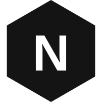

# NanoHEX

一个简易，简洁的 Typecho 博客主题

[预览主题 - 官方](https://jk.uegee.com/nanohex)  
[预览主题 - Typecho主题预览](https://demo.typecho.work/?theme=NanoHEX) (预览版本可能过旧，建议下载安装)

# 使用方法

1. `star`此项目
2. 从[releases](https://github.com/obentnet/Typecho-Theme-NanoHEX/releases)页面下载正式版
3. 上传本主题，重命名为 `nanohex` 并放置在 `usr/themes/` 目录下
4. 登录你的 Typecho 后台，启用主题~
5. 在`后台 -> 外观 -> 设置外观` 来设置你的个性化

如果需要使用友情链接，请安装 [Links](https://github.com/Mejituu/Links) 插件

# 主题亮点
基于 `豆包` \ `Grok` \ `Qwen` \ `Gemini` \ `DeepSeek` 制作的主题

特色页面：  
[赞助页面](/page-donate.php)、[友情链接页面](/page-donate.php) 需配合 [links](https://github.com/Mejituu/Links) 插件使用。

# 开源协议
本项目采用 MIT 开源协议进行授权，并在其基础上须保留原作者的版权注释（CSS、JS 等文件），当然能在页尾写上主题地址就是最好的啦~

原创不易！如果喜欢本项目，请 `Star` 它以示对我的支持~

同时欢迎前往 [Donate](https://ueg.ee?donate) 为我提供赞助，谢谢您！

# UPDATE
beta 1.2
 - 改用[ZeComments](https://github.com/jrotty/ZeComments) 作为评论功能模板

beta 1.3
 - 修改头部问题
 - 新增ajax无刷新加载
 - 新增标签集页面
 - 新增分类列表
 - 新增友情链接

# 鸣谢
[泽泽社](https://github.com/jrotty)  [奇趣保罗](https://github.com/Dreamer-Paul/)  
对于此主题，保罗给出了珍贵的意见如下:  
